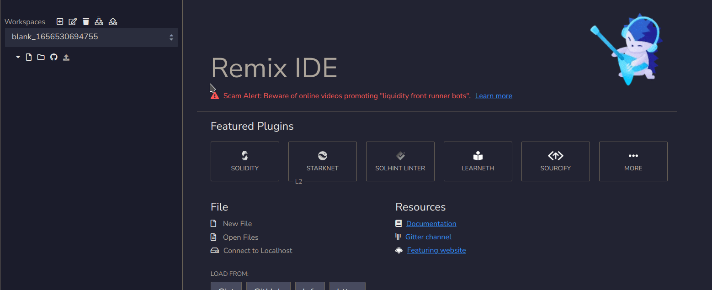

# Avalanche - Learn subnets by creating a Worknet

## Introduction

Hi there!

I think the best way of learning is by practice.

In this tutorial, we will create a subnet for doing freelance style work management, which we will call **Worknet**.

What the network will look like:
- Only admin and employees can make transactions on the network.
- Admin can add new tasks to the pool.
- Admin can add new employees to the system.
- When an employee is added, to make transactions and will also mint 15 native tokens to the employee.
- Admin can remove employees from the system. The employee won't be able to make transactions anymore.
- Employees must choose a task from the pool.
- After a task is completed, the employee can submit it for approval.
- Admin can approve or deny the task.
- If the task is approved, the system will mint the tokens for the task to the employee.
- The employee must deliver the task within the time limit.
- The employee pays a little fee (10 tokens) for choosing the task.
- Employees can claim 10 tokens every 24 hours.


## Table of Contents

- [Avalanche - Learn subnets by creating a Worknet](#avalanche---learn-subnets-by-creating-a-worknet)
  - [Introduction](#introduction)
  - [Table of Contents](#table-of-contents)
  - [Prerequisites](#prerequisites)
    - [Solidity](#solidity)
    - [Metamask](#metamask)
    - [Avalanche CLI](#avalanche-cli)
- [Creating and deploying the subnet](#creating-and-deploying-the-subnet)
  - [What is a subnet?](#what-is-a-subnet)
    - [Subnets](#subnets)
  - [Creating the subnet](#creating-the-subnet)
      - [Choose your VM](#choose-your-vm)
      - [Chain id](#chain-id)
      - [Token symbol](#token-symbol)
      - [Gas configuration](#gas-configuration)
      - [Airdropping native tokens](#airdropping-native-tokens)
      - [Adding a custom precompile to modify the EVM](#adding-a-custom-precompile-to-modify-the-evm)
        - [Native Minting](#native-minting)
        - [Configure Contract deployment whitelist](#configure-contract-deployment-whitelist)
        - [Configure Transaction allow list](#configure-transaction-allow-list)
  - [Deploying the subnet](#deploying-the-subnet)
- [Managing the subnet](#managing-the-subnet)
  - [Precompiled contracts](#precompiled-contracts)
    - [ContractDeployerAllowList](#contractdeployerallowlist)
    - [TxAllowList](#txallowlist)
    - [NativeMinter](#nativeminter)
  - [Contract Interface](#contract-interface)
  - [Remix IDE](#remix-ide)
  - [Creating interface files](#creating-interface-files)
  - [Interacting with contracts](#interacting-with-contracts)
- [Task Manager Contract](#task-manager-contract)
  - [Giving permissions to the contract](#giving-permissions-to-the-contract)
  - [Create a task](#create-a-task)
  - [Reading data from chain](#reading-data-from-chain)
  - [Adding a new employee](#adding-a-new-employee)
  - [Getting a task](#getting-a-task)
  - [Submitting a task for completion](#submitting-a-task-for-completion)
  - [Approving a task as admin](#approving-a-task-as-admin)
  - [Removing an employee](#removing-an-employee)
- [Conclusion](#conclusion)
- [Next steps](#next-steps)
  - [Private Subnets](#private-subnets)
  - [Bridge](#bridge)
- [Resources](#resources)

## Prerequisites

### Solidity
Solidity is a programming language used to write smart contracts. This tutorial assumes you have at least beginner-level solidity knowledge.

### Metamask
You need to have [Metamask](https://metamask.io/) extension installed on your browser.

### Avalanche CLI

Create a folder for Avalanche CLI.

```bash
$ mkdir -p ~/avalanche
```

Go to that directory and download the Avalanche CLI.

```bash
$ cd ~/avalanche
$ curl -sSfL https://raw.githubusercontent.com/ava-labs/avalanche-cli/main/scripts/install.sh | sh -s

> ava-labs/avalanche-cli info checking GitHub for latest tag
> ava-labs/avalanche-cli info found version: 0.1.3 for linux/amd64
> ava-labs/avalanche-cli info installed ./bin/avalanche
```

Go to the directory where you just downloaded the CLI and add it to your PATH. So you can run the CLI from anywhere.

```bash
$ cd ./bin/avalanche
$ export PATH=$PWD:$PATH
```

We're ready to deploy our first subnet.

# Creating and deploying the subnet

## What is a subnet?

> A subnet, or subnetwork, is a dynamic subset of Avalanche Primary Network validators working together to achieve consensus on the state of one or more blockchains. Each blockchain is validated by exactly one subnet. A subnet can have and validate many blockchains. A validator may be a member of many subnets. 
> 
> Subnets are independent and don’t share execution thread, storage or networking with other subnets or the Primary Network, effectively allowing the network to scale up easily. They share the benefits provided by the Avalanche Protocol such as low cost and fast to finality.
> 
> A subnet manages its own membership, and it may require that its constituent validators have certain properties. This is very useful, and we explore its ramifications in more depth below:

[Here is a great introduction to subnets by Avalanche](https://docs.avax.network/subnets)

### Subnets

Subnets is a great technology! It's still advancing and a bit complicated. There is almost no tooling for subnets and it's a bit difficult to work with them.

Avalanche has changed that! The Avalanche team has developed an amazing tool to make this process a breeze.
Now you can deploy your own production-ready subnet with just a few commands. The tool will guide you through configuring your subnet and deploying it!


## Creating the subnet

We will create and modify the subnet using the subnet wizard which is a very handy tool.

```bash
$ avalanche subnet create taskManagement
```

This command will run the wizard to create the subnet.

There are six steps in the wizard:

#### Choose your VM

Choose SubnetEVM here

#### Chain id

Chain id is a unique identifier for the network. You should pick a unique value here so check [chainlist](https://chainlist.org/) to see if the chain id is already in use.

I'll pick `424`.

#### Token symbol

Token symbol is the symbol of the native token used in the subnet. For instance, on the C-Chain, the symbol is `AVAX` and on the Ethereum mainnet, the symbol is `ETH`. You can use any symbol you want.

I'll go with `NANO` because I couldn't find anything better.

#### Gas configuration

This step will define the gas configuration of your network. You can choose a preset fee configuration or create your own. Keep in mind that more transaction throughput means more disk usage.

We will go with C-Chain default configuration.

```bash
> Low disk use    / Low Throughput    1.5 mil gas/s (C-Chain's setting)
```

#### Airdropping native tokens

This step will define how you want to distribute the funds in your subnet. You can choose the addresses and amounts you want to distribute.

We could pick `Airdrop 1 million tokens to the default address (do not use in production)` but that's dangerous, because the default address is exposed and could get stolen.

It's better to use our own address. Pick `Customize your airdrop` here.
Then type in your address and the airdrop amount. I'll airdrop 1000 tokens.

At first glance, I thought the airdrop amount was in Avax, but it's actually in nAvax. You can use [Snowtrace Unit Converter](https://snowtrace.io/unitconverter) to convert between units.

`1000` Avax is `1000000000000` nAvax. So I'll type `1000000000000` here.


```bash
Address to airdrop to: 0x0000000b9af48743ef1188f3F20c9b8B90F52a5b
Amount to airdrop (in AVAX units): 1000000000000
```

We don't want to airdrop to other addresses. Pick `No` when asked.

#### Adding a custom precompile to modify the EVM

```bash
? Advanced: Would you like to add a custom precompile to modify the EVM?: 
    No
  ▸ Yes
    Go back to previous step
```

We will set up a custom precompile to unlock native minting, contract deployment whitelist and transaction allowlist.

We're going to add our address as admin to all of these precompiled contracts.

##### Native Minting

This precompile allows admins to permit designated contracts to mint the native token on your subnet.

Choose `Native Minting`

```bash
? Choose precompile: 
  ▸ Native Minting
    Contract deployment whitelist
    Transaction allow list
    Cancel
```

Choose `Add admin`

```bash
? Configure native minting allow list: 
  ▸ Add admin
    Remove admin
    Preview
    More info
↓   Done
```

Type in your address and press enter.

```bash
✔ Admin Address: 0x0000000b9af48743ef1188f3F20c9b8B90F52a5b
```

Choose `Done` to quit.

##### Configure Contract deployment whitelist

Choose `Contract deployment whitelist`

```bash
This precompile restricts who has the ability to deploy contracts on your subnet.
? Choose precompile: 
  ▸ Contract deployment whitelist
    Transaction allow list
    Cancel
```

Choose `Add admin`

```bash
? Configure native minting allow list: 
  ▸ Add admin
    Remove admin
    Preview
    More info
↓   Done
```

Type in your address and press enter.

```bash
✔ Admin Address: 0x0000000b9af48743ef1188f3F20c9b8B90F52a5b
```

Choose `Done` to quit.

##### Configure Transaction allow list

This precompile restricts who has the ability to make transactions on your subnet.

```bash
? Choose precompile: 
  ▸ Transaction allow list
    Cancel
```

Choose `Add admin`

```bash
? Configure native minting allow list: 
  ▸ Add admin
    Remove admin
    Preview
    More info
↓   Done
```

Type in your address and press enter.

```bash
✔ Admin Address: 0x0000000b9af48743ef1188f3F20c9b8B90F52a5b
```
Choose `Done` to quit.

```bash
> Successfully created genesis
```

You just created a subnet! 👏🎉

The wizard will create a genesis file for our subnet according to the configuration you provided. You can also create a genesis file manually. I've written a guide on how to do this [here](https://github.com/trizin/avax-subnet-customization).


## Deploying the subnet

This is the most fun part. We will deploy the subnet that we just created, and it's so easy, thanks to Avalanche CLI!

```bash
$ avalanche subnet deploy taskManagement

> ? Choose a network to deploy on:
  ▸ Local Network
    Fuji
    Mainnet
```

We will deploy the subnet on a local network so choose `Local Network` here.

This process will install Avalanchego (if not already installed) and start the network. This will take a couple of minutes so, this is a good time to refresh your coffee ☕

After this process is complete, you will see the Metamask connection details in the terminal.

```bash
Metamask connection details (any node URL from above works):
RPC URL:          http://127.0.0.1:41438/ext/bc/V4d5nQt8CcrDpTcgpYGTTbuWvzrhb27yNLXpeDt1fMA7JHePs/rpc
Funded address:   0x0000000b9af48743ef1188f3F20c9b8B90F52a5b with 1000
Network name:     taskManagement
Chain ID:         424
Currency Symbol:  NANO
```

You can use this configuration to add a new network to your metamask. Then you can import the account to which the airdrop funds were sent to into your metamask by importing the private key.


Click `Save`


Great! The subnet seems to be working. 1000 Nano tokens airdropped to our address!

# Managing the subnet

In this section, we will learn how to manage the subnet and how can we give access to other users to the subnet.

## Precompiled contracts

Remember that we added a custom precompile to modify the EVM? We are going to use those contracts to manage the subnet.

Each precompiled contract has a specific address and an interface:

### ContractDeployerAllowList
This contract is deployed at `0x0200000000000000000000000000000000000000` and allows us to manage who can deploy contracts on the subnet.
[Find more information here on Avalanche Docs.](https://docs.avax.network/subnets/customize-a-subnet#restricting-smart-contract-deployers)

### TxAllowList
This contract is deployed at `0x0200000000000000000000000000000000000002` and allows us to manage who can make transactions on the subnet.
[Find more information here on Avalanche Docs.](https://docs.avax.network/subnets/customize-a-subnet#restricting-who-can-submit-transactions)

### NativeMinter
This contract is deployed at `0x0200000000000000000000000000000000000001` and allows us to mint native tokens and manage who can mint native tokens on the subnet.
[Find more information here on Avalanche Docs.](https://docs.avax.network/subnets/customize-a-subnet#minting-native-coins)


## Contract Interface

We are going to use an interface to interact with the precompiled contracts. A contract interface is the definition of the public functions in the contract and it's a solidity file.

Each of the three contracts has:
- `setAdmin(address)` - Set the given address to have the admin role over the allow list
- `setEnabled(address)` - Set the given address to be enabled on the allow list
- `setNone(address)` - Set the given address to have no role over the allow list
- `readAllowList(address)` - Read the status of given address.

Additionally, `NativeMinter` has:
- `mintNativeCoin(address, amount)` - Mint `amount` native tokens to the given address


## Remix IDE

We're going to use [remix](https://remix.ethereum.org/) to interact with the contracts. Remix is a web-based IDE that allows you to interact with the contracts.

Start by creating a blank workspace.



Then create a new folder. You can name it `main`, we will place all files under it.


## Creating interface files

Create a file `interfaces.sol` and paste the following code:

```solidity
// (c) 2022-2023, Ava Labs, Inc. All rights reserved.
// See the file LICENSE for licensing terms.

// SPDX-License-Identifier: MIT

pragma solidity >=0.8.0;

interface TxAllowListInterface {
    // Set [addr] to have the admin role over the minter list
    function setAdmin(address addr) external;

    // Set [addr] to be enabled on the minter list
    function setEnabled(address addr) external;

    // Set [addr] to have no role over the minter list
    function setNone(address addr) external;

    // Read the status of [addr]
    function readAllowList(address addr) external view returns (uint256);
}


interface ContractDeployerAllowListInterface {
    // Set [addr] to have the admin role over the minter list
    function setAdmin(address addr) external;

    // Set [addr] to be enabled on the minter list
    function setEnabled(address addr) external;

    // Set [addr] to have no role over the minter list
    function setNone(address addr) external;

    // Read the status of [addr]
    function readAllowList(address addr) external view returns (uint256);
}

interface NativeMinterInterface {
    // Set [addr] to have the admin role over the minter list
    function setAdmin(address addr) external;

    // Set [addr] to be enabled on the minter list
    function setEnabled(address addr) external;

    // Set [addr] to have no role over the minter list
    function setNone(address addr) external;

    // Read the status of [addr]
    function readAllowList(address addr) external view returns (uint256);

    // Mint [amount] number of native coins and send to [addr]
    function mintNativeCoin(address addr, uint256 amount) external;
}
```

We will have all interfaces in a single file, you could also have them in separate files.

Then go to the compile tab, and compile the file.


Then follow these steps:


- 1: Go to the deploy tab.
- 2: Chooce `Injected Web3` as environment.
- Then for each precompiled contract:
  - 3: Choose the appropriate interface.
  - 4: Fill in the address in the `Load contract from Address` field.
  - 5: Click `At Address`

Contract addresses:
- ContractDeployerAllowList: `0x0200000000000000000000000000000000000000`
- TxAllowList: `0x0200000000000000000000000000000000000002`
- NativeMinter: `0x0200000000000000000000000000000000000001`


After following the steps above, it should look like this:


## Interacting with contracts

To interact with a contract, click on the little arrow left of the contract name.  
You will see a list of functions you can call.

For example, let's try minting ourselves some native tokens. Expand the NativeMinterInterface contract and call the `mintNativeCoin` function with your address and the amount of tokens you want to mint.

**Note that the amount is in wei.** You can use [Snowtrace Unit Converter](https://snowtrace.io/unitconverter) to convert between units.


I minted myself 1 Nano token! As you can see, it's pretty straightforward to interact with the contracts and manage the subnet.

[Here is a list of all the functions you can call.](#contract-interface)


# Task Manager Contract

I've written a simple task manager contract. You don't need to fully understand this contract. I've added as many comments as I could to make it easier to understand. I highly encourage you to read the code and try to understand it even if you don't know much solidity.

Here is the code:

```solidity
pragma solidity ^0.8.7;

import "./interfaces.sol";

contract TaskManager {
    address admin; // wallet address of the admin
    NativeMinterInterface minter =
        NativeMinterInterface(0x0200000000000000000000000000000000000001); // native minter contract
    TxAllowListInterface txallowlist =
        TxAllowListInterface(0x0200000000000000000000000000000000000002); // txallowlist contract

    enum TaskStatus {
        NOT_ASSIGNED,
        PENDING,
        PENDING_APPROVAL,
        COMPLETED,
        CANCELLED
    }

    struct Task {
        // structure for a task
        uint256 id;
        string name;
        string description;
        string employee_description;
        string reject_reason;
        TaskStatus status;
        uint256 reward;
        uint256 deadline;
        address assignee;
    }

    mapping(uint256 => Task) tasks; // mapping of task id to task

    uint256 nextTaskId; // counter for the next task id

    constructor() {
        admin = msg.sender; // set the admin to the deployer of the contract
    }

    function createTask(
        string memory _name,
        string memory _description,
        uint256 _reward,
        uint256 _deadline
    ) external {
        // create a new task
        require(msg.sender == admin); // require the sender to be the admin
        require(_deadline > block.timestamp); // require the deadline to be in the future

        Task memory task;
        task.id = nextTaskId; // set the id to the next id
        task.name = _name; // set the name
        task.description = _description; // set the description
        task.status = TaskStatus.NOT_ASSIGNED; // set the status to not assigned
        task.reward = _reward; // set the reward
        task.deadline = _deadline; // set the deadline
        tasks[nextTaskId] = task; // add the task to the mapping
        nextTaskId++; // increment the next task id
    }

    function assignTask(uint256 _taskId) external payable {
        require(msg.value == 10 ether); // require the sender to pay 10 Nano tokens
        require(_taskId < nextTaskId); // require the task id to be valid
        require(tasks[_taskId].status == TaskStatus.NOT_ASSIGNED); // require the task to be not assigned
        require(tasks[_taskId].deadline > block.timestamp); // require the deadline to be in the future
        tasks[_taskId].assignee = msg.sender; // set the assignee to the sender
        tasks[_taskId].status = TaskStatus.PENDING; // set the task status to pending
    }

    function submitTask(uint256 _taskId, string memory description) external {
        require(tasks[_taskId].assignee == msg.sender); // require the assignee to be the sender
        require(tasks[_taskId].status == TaskStatus.PENDING); // require the task to be pending
        tasks[_taskId].employee_description = description; // set the employee description
        if (tasks[_taskId].deadline < block.timestamp) {
            tasks[_taskId].status = TaskStatus.CANCELLED; // set the task status to cancelled
        } else {
            tasks[_taskId].status = TaskStatus.PENDING_APPROVAL; // set the task status to pending approval
        }
    }

    function completeTask(uint256 _taskId) external {
        // complete a task
        require(msg.sender == admin); // require the sender to be the admin
        require(tasks[_taskId].status == TaskStatus.PENDING_APPROVAL); // require the task to be pending

        tasks[_taskId].status = TaskStatus.COMPLETED; // set the status to completed
        minter.mintNativeCoin(tasks[_taskId].assignee, tasks[_taskId].reward); // mint native tokens to the assignee
    }

    function rejectTask(uint256 _taskId, string memory rejection_reason)
        external
    {
        // reject a task
        require(msg.sender == admin); // require the sender to be the admin
        require(tasks[_taskId].status == TaskStatus.PENDING_APPROVAL); // require the task to be pending
        tasks[_taskId].status = TaskStatus.PENDING; // set the status to cancelled
        tasks[_taskId].reject_reason = rejection_reason; // set the rejection reason
    }

    function addEmployee(address _employee) external {
        // add an employee
        require(msg.sender == admin); // require the sender to be the admin
        txallowlist.setEnabled(_employee); // allow the employee to make transactions
        minter.mintNativeCoin(_employee, 15 ether); // mint 15 Nano tokens to the new employee
    }

    function removeEmployee(address _employee) external {
        // remove an employee
        require(msg.sender == admin); // require the sender to be the admin
        txallowlist.setNone(_employee); // disable the employee from making transactions
    }

    mapping(address => uint256) lastClaim;

    // Employees can claim tokens every 24 hours
    function claimTokens() external {
        uint256 lastClaimed = lastClaim[msg.sender]; // get the last claimed time
        if (lastClaimed + 24 * 60 * 60 < block.timestamp) {
            // if the last claimed time is 0 or the last claimed time is more than 24 hours ago
            minter.mintNativeCoin(msg.sender, 10 ether); // mint 10 Nano tokens
            lastClaim[msg.sender] = block.timestamp; // set the last claimed time to the current time
        }
    }

    // view functions

    function getTask(uint256 _taskId) public view returns (Task memory) {
        // get a task
        return tasks[_taskId]; // return the task
    }

    function getTasksByStatus(uint256 _status)
        public
        view
        returns (Task[] memory)
    {
        // get all tasks by status
        Task[] memory tasks_array = new Task[](nextTaskId); // create an array to store the tasks
        uint256 tasks_count = 0; // start the tasks count at 0
        for (uint256 i = 0; i < nextTaskId; i++) {
            // iterate through all tasks
            if (uint256(tasks[i].status) == _status) {
                // if the task status matches the given status
                tasks_array[tasks_count] = tasks[i]; // add the task to the array
                tasks_count++; // increment the tasks count
            }
        }
        return tasks_array; // return the tasks
    }
}

```

On remix ide, create a new file called `TaskManager.sol` then compile and deploy it!


You should see it under the `Deployed Contracts`.

## Giving permissions to the contract

Before using it, we should give the necessary permissions to the contract.

On `NativeMinter` contract call `setEnabled` function and on the `TxAllowList` contract call `setAdmin` function with the address of the `TaskManager` contract.

This will allow the `TaskManager` contract to add new addresses to the transaction allow list. The contract will also be able to mint native tokens

We don't need to do it for the `ContractDeployerAllowList` contract, because `TaskManager` contract doesn't need to deploy any other contracts.

After giving the permissions, let's create our first task.

## Create a task


Notice that the reward is in wei (5000 Nano tokens) and the deadline is in Unix epoch time. You should specify a deadline in the future. I'm setting it to `2000000000` to make sure it's pretty much in the future.

Set the parameters and complete the transaction.

## Reading data from chain
Maybe you have noticed that there are some view functions in the contract.
These functions don't change the state of the contract, but they return some data. We can use these functions to read data from the chain.

There is an enum for `TaskStatus`. Instead of using an integer, we're using an enum becuase it's more readable.

```solidity
enum TaskStatus {
    NOT_ASSIGNED, // 0
    PENDING, // 1 
    PENDING_APPROVAL, // 2
    COMPLETED, // 3
    CANCELLED // 4
}
```


Call `getTaskByStatus` function with the status with the status `0` (`NOT_ASSIGNED`).


This will return an array of tasks with the status `NOT_ASSIGNED`. You can see the tasks we just created. The order of the fields is based on the `Task` struct in the contract.

```solidity
struct Task {
    uint256 id;
    string name;
    string description;
    string employee_description;
    string reject_reason;
    TaskStatus status;
    uint256 reward;
    uint256 deadline;
    address assignee;
}
```

In the returned tuple: 
- The first field is the task id. 
- The second field is the task name. 
- The third field is the task description. 
- The fourth field is the employee description. 
- The fifth field is the rejection reason. 
- The sixth field is the status. 
- The seventh field is the reward. 
- The eighth field is the deadline. 
- The ninth field is the assignee address.

We can also read tasks by their id. Since this is our first task, the id is `0`.

You can parse these data into a more readable format on the frontend.


## Adding a new employee

There is a problem with our system. We don't have any employees! Who's going to do the tasks?

Let's add a new employee! I'll create a new account in my metamask. Here is the address of it:

Employee = `0x350f2d2C4a98379Bce43C9CecD23247428b50268`

You can try to send some Nano tokens to this address and then try to transfer those tokens. You will get an error because this address doesn't have permissions to make transactions.

So, firstly we will call the `addEmployee` function with the address of the employee.


This will add the employee address to transaction allowlist and mint 15 Nano tokens for the employee.

`TaskManager` contract does that by interacting with the precompiled contracts. It's possible because [we gave the necessary permissions](#giving-permissions-to-the-contract).

Now check the balance of the employee and try to make a transaction.


15 Nano tokens were minted to the employee and it can now make transactions! 🎉


## Getting a task

As the employee, we can assign a task to ourself. Firstly, open metamask and make sure you're connected to remix with the employee account.

We will call `assignTask` function with the task id `0`.

Remember that the employee must pay 10 Nano tokens to get the task. So make sure you set the `Value` field to 10 ether in remix.


Set that and make the transaction with the task id `0`. After the transaction is mined, you should see the task status changed to `PENDING`. Try getting the list of tasks with the status `PENDING` by calling `getTasksByStatus` function with the status `1` (`PENDING`) and see if the task is there.


Awesomeness! This means that the task was assigned to the employee and now the employee is working on the task.

## Submitting a task for completion

As a hard working employee, you've already finished the task. Now you can submit the task for completion.

We will use the `submitTask` function. We need to pass the task id and description of the work done from the Employee wallet.


Make the transaction and after the transaction is mined, you should see the task status changed to `PENDING_APPROVAL`. Try getting the list of tasks with the status `PENDING_APPROVAL` by calling `getTasksByStatus` function with the status `2` (`PENDING_APPROVAL`) and see if the task is there.


Fantastic! The task was submitted for completion and the tuple object contains the description of the work done. Now the admin can approve or reject the task.

## Approving a task as admin

Firstly, switch to admin account from the metamask.

In a normal system, frontend would call the `getTasksByStatus` function with the status `PENDING_APPROVAL` and it would parse the tasks and show them to the admin.

We already know the task with id `0` is pending approval.

Let's approve it then.

Call `completeTask` function with the task id `0`. After the transaction is mined, you should see the task status changed to `COMPLETED` (3) !

Even better! Switch to the employee account and you will see that the account balance is increased by 5000 Nano tokens. This is the reward we set for completing the task and the `TaskManager` contract minted those native tokens when the task was completed by interacting with the precompiled contracts.

How fantastic is that!!


## Removing an employee

As the admin, we didn't like the employee. Let's remove them.

Before calling the function, make sure you're connected to remix with the admin account. Only the admin can remove employees.

Call the `removeEmployee` function with the address of the employee.


Let's switch back to the employee account and try to make a transaction. You should get an error.


The employee account cannot make transactions anymore. When you called `removeEmployee` function, the `TaskManager` contract called the `setNone` function on the `TxAllowlist` contract.


# Conclusion
Congrats! This is the end of the tutorial. I hope you've enjoyed it as much as I've enjoyed writing it!

We've learned how to to create, customize, and deploy a subnet. We also learned how to interact with the precompiled contracts and built the WorkNet!

I'd not recommend you to use the `TaskManager` contract in a production environment. I've written it to demonstrate the concepts so it has some missing features.

Please feel free to ask me any questions you have by creating a new issue.

Thanks for reading! :heart:


# Next steps

## Private Subnets
In our subnet, no one can submit transactions unless they have the permission to do so. However, anyone can read the chain and get the data from the contract.

You can prevent that by configuring the subnet to be validator only.

> If a node sets validatorOnly to true, the node exchanges messages only with this subnet's validators. Other peers will not be able to learn contents of this subnet from this node.

[Learn more on Avalanche docs.](https://docs.avax.network/nodes/maintain/subnet-configs#private-subnet)

## Bridge

Nano tokens are not exchangeable in the subnet. They have no worth.

You could build a bridge between your subnet and a public network. This will let employees to withdraw their tokens to that network. For example you could create a Nano - Avax liquidity pool on C-Chain so the employees can exchange their tokens to Avax by briding the tokens from your subnet to C-Chain and swapping the tokens.

# Resources
- [Avax Docs](https://docs.avax.network/subnets)